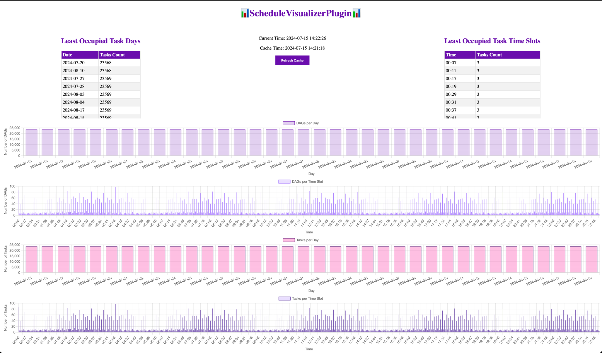

# Plugin for visualizing DAG and task schedules in Airflow.

This plugin was written to study the capabilities of Airflow and writing plugins for it. It allows you to visualize the
schedules of DAG and tasks in Airflow and find less busy days and time slots.
This code can be improved and refined by adding new features and improving visualization, but I will not do this 😀.
You can fork and improve the plugin for your needs! Thank you for understanding and I hope this plugin will help you 🙂.

## Installation

* Download the repository with the plugin and copy the `schedule_visualizer_plugin` folder to the `plugins` directory of
  your Airflow. If you are using Docker, configure the `Dockerfile` to copy the plugin to the Airflow container.
  Example command: `COPY airflow-etl/plugins/ /opt/airflow/plugins/`
* Rebuild the Airflow image and restart the container.

## Usage

After installing and restarting Airflow, a new menu item 📊ScheduleVisualizerPlugin📊 will appear in the Airflow menu.
When you click on this item, a page with a visualization of the schedules of DAG and tasks will open.

On the page you will find:

* Tables with the least busy days and time slots.
* Charts showing the number of DAG and tasks by day and time.

## Data caching

Data is cached for 24 hours (`MAX_CACHE_HOURS_AGE`). You can update the cache by clicking the `Refresh Cache` button.

## Project structure

```
plugins/
├── schedule_visualizer_plugin/
│   ├── plugins/
│   │   ├── __init__.py
│   │   └── schedule_visualizer_plugin.py
│   ├── templates/
│   │   └── schedule_visualizer_plugin/
│   │       └── schedule_visualizer_plugin.html
│   README.md
│   __init__.py
```

## Screenshots
