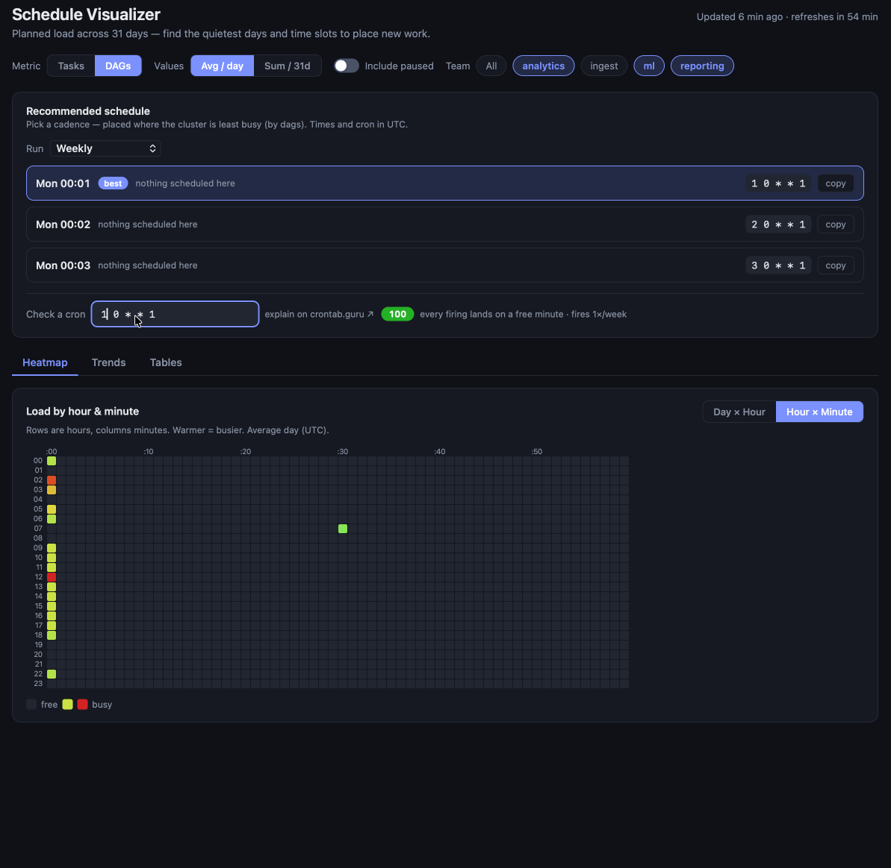

# Schedule Visualizer — Airflow 3 plugin

Visualize DAG/task **schedule load** a month ahead and find the **least-busy days
and time slots**.

Teams schedule independently, so runs pile onto round times — midnight, the top of
the hour — spiking the cluster then while other slots sit idle. Schedule Visualizer
shows the planned load so you can drop new work into the quiet gaps instead of the
peaks (it even suggests a cron for a given cadence).

Rebuilt for **Airflow 3** (the Airflow-2 Flask/FAB version is gone). One codebase,
two modes:

- **OSS / single-tenant** — one global picture.
- **Multi-team platform** — same plugin on a shared api-server; global picture for
  everyone, optional per-team lens.



## Try it

```bash
make demo   # seeds schedules, builds the UI, serves http://127.0.0.1:8888
```

No Airflow database needed — the demo runs on seeded schedules.

## Architecture (ports & adapters)

Grouped by layer — pure logic at the top, Airflow coupling in `airflow_io/`, the
HTTP surface in `web/`:

```text
schedule_visualizer/
  core.py          pure aggregation: events → day×hour + minute + week-minute histograms
  suggest.py       pure: least-contended placement per cadence (5 min…monthly) + cron
  assess.py        grade an existing cron 0–100 against the aggregated load
  cache.py         single-flight TTL cache (swap in Redis behind this interface)
  config.py        env-driven settings
  service.py       composition: loader → adapter → core → cache; window + logging
  plugin.py        AirflowPlugin: mounts the app + nav entry, guards it with auth
  airflow_io/
    adapter.py     timetable → planned runs (next_dagrun_info; dedup per schedule)
    loader.py      metadata DB → ScheduledDag; pluggable team resolver
  web/
    serialize.py   aggregate → JSON payload
    api.py         FastAPI data API + static UI
frontend/          React + Vite UI, built into schedule_visualizer/static/
```

- **Aggregation** (`core.py`): a joint day×hour histogram is the single source for
  the day, hour and heatmap series; a minute histogram drives the per-minute slot
  table; a minute-of-week histogram feeds weekly suggestions. Tenancy is a filter
  (`view(teams)`), so one cached aggregate serves the global and per-team views.
- **Suggestions** (`suggest.py`): for a chosen cadence (5/10/15/30 min,
  1/2/4/6/12 h, daily, weekly, monthly) it finds the phase that adds the least
  load and returns a ready-to-paste cron. The UI exposes it as a "Recommended
  schedule" picker, next to a checker that grades any existing cron 0–100
  against the same load (`assess.py`, `GET /api/assess`).
- **Team attribution** is a pluggable resolver (default: a `team:<name>` tag; the
  platform injects a bundle-name resolver).
- **Serving**: the app mounts on the existing api-server (no new port). The data
  endpoint is behind Airflow's current-user check, so only logged-in sessions
  reach it. No public refresh endpoint — the cache refreshes on TTL. One log line
  per recompute, none per request (Airflow already access-logs requests).

## Develop

Requires [uv](https://docs.astral.sh/uv/) and Node.

```bash
make setup          # uv venv + airflow + pre-commit hooks
make test           # pytest
make smoke          # loader integration check against a throwaway Airflow metadb
make pre-commit     # ruff, ty, gitleaks, yamllint
make frontend-dev   # Vite dev server (pair with `make demo-api`)
make build          # rebuild the UI + wheel
```

The built UI bundle (`src/schedule_visualizer/static/`) is committed — there is no
build step in CI, so after changing the frontend run `make build` and commit the
regenerated `static/`. This keeps `pip install`-from-git shipping the UI.

All time-of-day analysis (heatmap, slots, suggestions, generated crons) is in
**UTC** — the zone timetables emit. Converting minute-of-day to a local zone is
unstable across DST, so the UI states the zone rather than shifting buckets.

Contributing and the full layout: [CONTRIBUTING.md](CONTRIBUTING.md).

## Install in Airflow

`pip install` the package (or add it to your Airflow image). The
`airflow.plugins` entry point registers it automatically — restart the api-server
and open **Schedule Visualizer** in the nav.

Optional env:

- `SCHEDULE_VIZ_TTL_SECONDS`, `SCHEDULE_VIZ_WINDOW_DAYS` — cache TTL and window.
- `SCHEDULE_VIZ_TEAM_SOURCE` — `tag` (default; team from a `team:<name>` tag) or
  `bundle` (team from the source bundle name, for the multi-team platform).
- `SCHEDULE_VIZ_TEAM_TAG_PREFIX` — tag prefix when `team_source=tag` (default `team:`).
